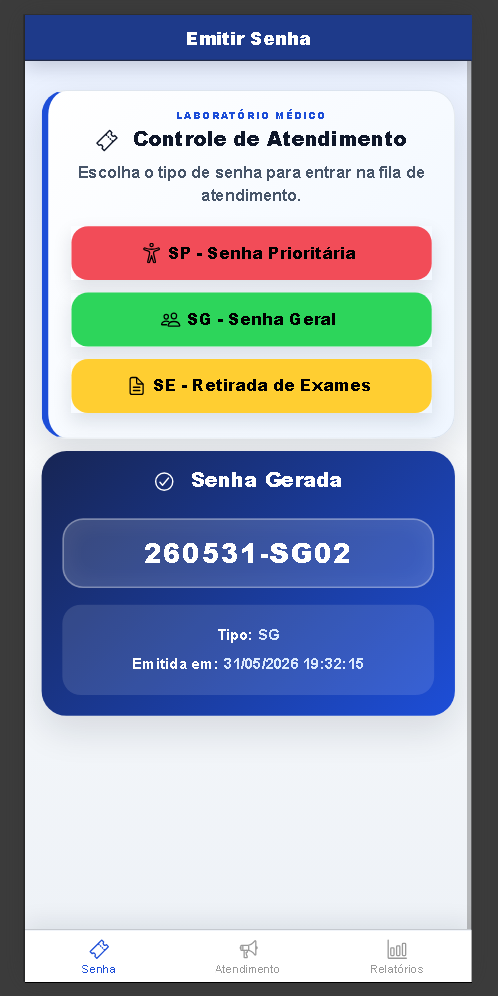
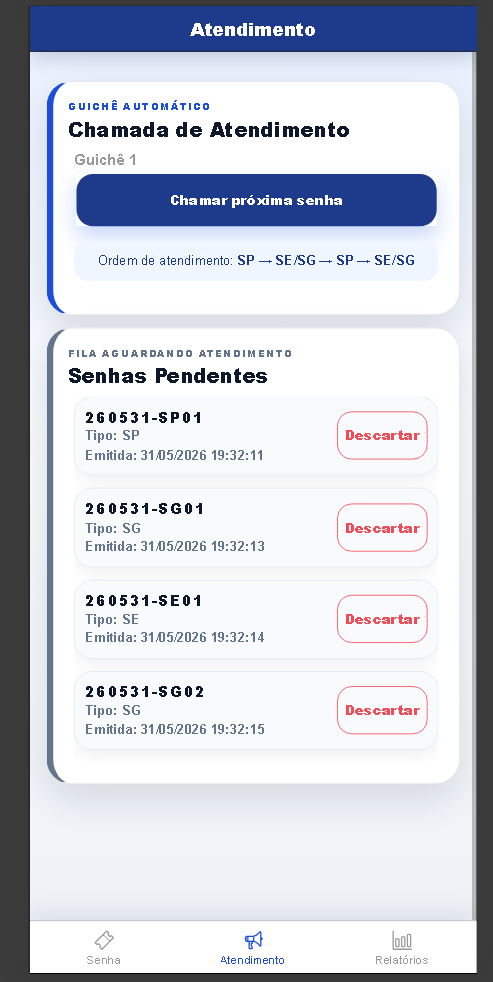
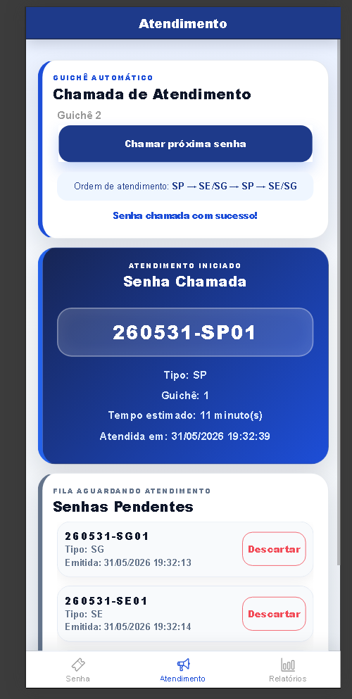
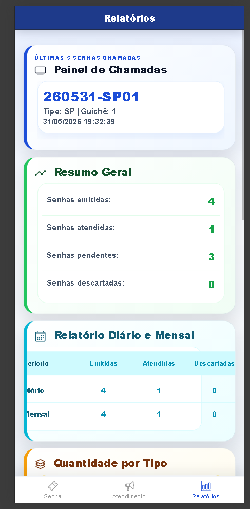
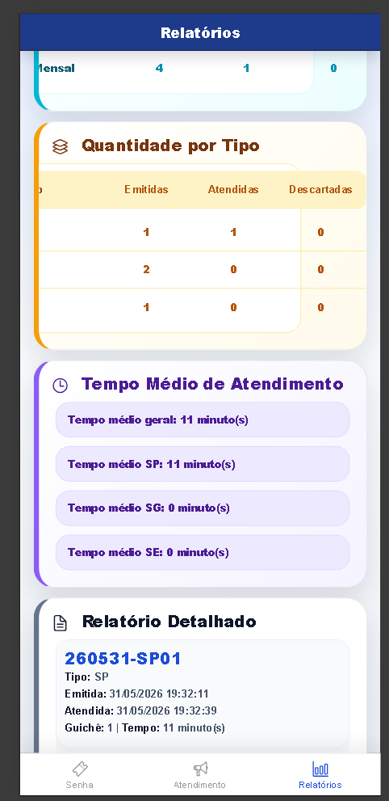

# 🎫 MobileTicketsIonic

Sistema mobile para controle de atendimento em filas de laboratórios médicos, desenvolvido com **Ionic**, **Angular com ngModules** e **Capacitor**.

O projeto simula a emissão de senhas, chamada por prioridade, controle de guichê, painel de últimas chamadas e relatórios de atendimento, conforme os requisitos do sistema de tickets proposto.

---
## 📱 Preview do Projeto

### Emissão de Senhas



### Chamada de Atendimento

| Atendimento | Atendimento - Continuação |
| ----------- | ------------------------- |
|  |  |

### Relatórios

| Relatórios | Relatórios - Continuação |
| ---------- | ------------------------ |
|  |  |

---

## 🎯 Objetivo

O objetivo do **MobileTicketsIonic** é representar um sistema de controle de atendimento por tickets/senhas para laboratórios médicos.

A aplicação permite que o cliente emita uma senha, que o atendente chame a próxima senha da fila e que o sistema controle a ordem de atendimento, o guichê responsável e os relatórios de atendimento.

---

## 👥 Agentes do Sistema

O sistema trabalha com três agentes principais:

* **AS - Agente Sistema:** emite senhas e controla as chamadas.
* **AA - Agente Atendente:** aciona o sistema para chamar a próxima senha.
* **AC - Agente Cliente:** emite sua senha e aguarda a chamada no painel.

---

## 🎟️ Tipos de Senha

O sistema possui três tipos de senha:

* **SP - Senha Prioritária**
* **SG - Senha Geral**
* **SE - Senha para Retirada de Exames**

---

## 🔢 Modelo de Numeração

Cada senha segue o modelo:

```text
YYMMDD-PPSQ
```

Onde:

* **YY:** ano da emissão com dois dígitos
* **MM:** mês da emissão com dois dígitos
* **DD:** dia da emissão com dois dígitos
* **PP:** tipo da senha
* **SQ:** sequência da senha por tipo

Exemplo:

```text
260531-SP01
260531-SG01
260531-SE01
```

---

## ⚙️ Regra de Atendimento

A chamada das senhas segue a regra de prioridade:

```text
SP → SE/SG → SP → SE/SG
```

A senha prioritária possui maior prioridade. Após uma senha prioritária, o sistema busca uma senha de retirada de exames ou uma senha geral, conforme disponibilidade na fila.

Não há guichê exclusivo por tipo de senha. Qualquer guichê pode atender qualquer tipo de senha.

---

## 🕒 Expediente

O sistema considera o expediente de atendimento das:

```text
07h às 17h
```

Caso existam senhas pendentes ao final do expediente, elas podem ser descartadas sem execução do atendimento.

A validação do expediente está localizada no arquivo:

```text
src/app/services/ticket.service.ts
```
Na função :

```text
expedienteAberto(): boolean {
  const agora = new Date();
  const hora = agora.getHours();

  return hora >= 7 && hora < 17;
}
```
Com essa regra, o sistema só permite chamadas de atendimento entre 07h e 17h.

Caso seja necessário testar o sistema fora desse horário, a função pode ser alterada temporariamente para:

```text
expedienteAberto(): boolean {
  return true;
}
```
Essa alteração libera as chamadas de atendimento em qualquer horário apenas para fins de teste ou apresentação.

---

## 📊 Relatórios

O sistema apresenta relatórios com:

* Quantitativo geral de senhas emitidas
* Quantitativo geral de senhas atendidas
* Quantitativo de senhas emitidas por tipo
* Quantitativo de senhas atendidas por tipo
* Quantitativo de senhas descartadas
* Relatório diário
* Relatório mensal
* Relatório detalhado das senhas
* Relatório do TM - Tempo Médio de atendimento

---

## ✅ Funcionalidades Implementadas

### 🎫 Módulo Cliente - Emissão de Senhas

* Emissão de senha prioritária
* Emissão de senha geral
* Emissão de senha para retirada de exames
* Geração automática da numeração da senha
* Exibição da senha gerada ao cliente

### 📢 Módulo Atendente - Chamada de Atendimento

* Chamada da próxima senha da fila
* Aplicação da regra de prioridade
* Definição automática de guichê
* Exibição da senha chamada
* Exibição do guichê responsável
* Descarte de senhas não atendidas

### 📺 Módulo Painel e Relatórios

* Painel com as últimas 5 senhas chamadas
* Relatório geral de atendimento
* Relatório diário e mensal
* Quantidade por tipo de senha
* Relatório do tempo médio de atendimento
* Relatório detalhado com emissão, atendimento, guichê e status

---

## 🛠️ Stack Tecnológica

* **Ionic** - criação da interface mobile e componentes visuais.
* **Angular** - estruturação da aplicação e lógica das telas.
* **Angular com ngModules** - organização do projeto conforme o requisito da atividade.
* **Capacitor** - integração mobile do projeto Ionic.
* **TypeScript** - linguagem utilizada na lógica da aplicação.
* **SCSS** - estilização e responsividade das telas.
* **Ionicons** - ícones utilizados na interface.

---

## 📂 Estrutura do Projeto

O projeto foi criado com as seguintes características:

* **Nome:** MobileTicketsIonic
* **Template:** tabs
* **Tipo:** Angular com ngModules
* **Integração:** Capacitor

---

## 🚀 Como Executar o Projeto

Clone o repositório:

```bash
git clone https://github.com/Joaovitor-bot/MobileTicketsIonic.git
```

Entre na pasta do projeto:

```bash
cd MobileTicketsIonic
```

Instale as dependências:

```bash
npm install
```

Execute o projeto no navegador:

```bash
ionic serve
```

---

## 📸 Imagens Utilizadas no README

As imagens do projeto estão localizadas em:

```text
src/assets/screens/tela1.png
src/assets/screens/tela2.png
src/assets/screens/tela2continuação.png
src/assets/screens/tela3.png
src/assets/screens/tela3continuação.png
```

---

## 👨‍💻 ALuno 

**João Vitor Rodrigues da Silva** - 01747616<br>
**Eychila Meirelle da Silva** - 01567091<br>
**Maria Clara Trevizane Buonafina** - 01747760<br>
**Maria Eduarda Trevizane Buonafina** - 01748239<br>
**Luís Fernando Andrade da Silva** - 01747654<br>
---

## 📄 Licença

Este projeto está licenciado sob a licença **MIT**.
